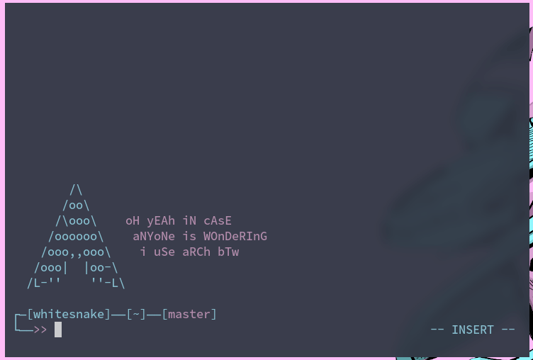

# st - simple terminal
st is a simple terminal emulator for X which sucks less.



_All terminal commands run in this demonstration are performed using vim-like 
keybindings..._<br />_**no mouse required.**_

> This fork is a maintained version of st intended for use in my
> [dotfiles](https://github.com/bossley9/dotfiles). You can view the source
> hosted by suckless [on their own git server](https://git.suckless.org/st).

## Table of Contents
1. [Installation](#installation)
2. [Running](#running)
3. [Configuration](#configuration)
4. [Patches](#patches)

## Installation <a name="installation"></a>
In order to build st you need the `Xlib` header files. For this specific fork of st, you
will also need the `envsubst` utility in order to compile in template variables.

As mentioned previously, this fork makes use of the `envsubst` package to insert system
environment variables into the configuation. The template file named is `template.config.h`
for visibility.

    envsubst < template.config.h > config.h
    sudo make clean install

## Running <a name="running"></a>
After building, running the terminal is as simple as

    st

> See the man page for additional details on usage.

## Configuration <a name="configuration"></a>
If you are compiling using `envsubst`, additional configuration of this st build is done 
by modifying the `template.config.h` file and (re)compiling the source code.

If you are not using `envsubst`, configuration is done by modifying the `config.h` file.

For more information on configuration, Suckless tools, and how st works, 
read [the readme](https://git.suckless.org/st/file/README.html).

## Patches <a name="patches"></a>
To apply patches to any suckless tool, download patches from the suckless website (or make 
your own) and run the following command, making sure to specify the file being changed as 
`template.config.h` instead of the standard `config.def.h`.
```
patch --merge -i patchName.diff
```

In addition to my own personal tweaks and settings, below is a list of popular patches 
I have included in my st build.

- [alpha 0.8.2](https://st.suckless.org/patches/alpha)
- [scrollback 20200419-72e3f6c](https://st.suckless.org/patches/scrollback)
- [scrollback-mouse 20191024-a2c479c](https://st.suckless.org/patches/scrollback)
- [scrollback-mouse-altscreen 20200416-5703aa0](https://st.suckless.org/patches/scrollback)
- [colors-at-launch 0.8.4](https://st.suckless.org/patches/colors_at_launch)
- [any-geometry 0.8.1](https://st.suckless.org/patches/anygeometry)
- [Xresources 20200604-9ba7ecf](https://st.suckless.org/patches/xresources)
